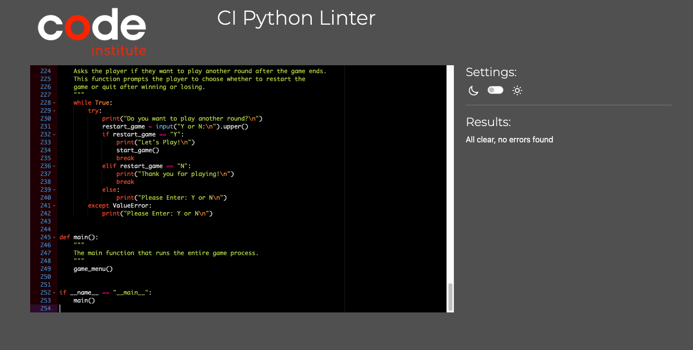
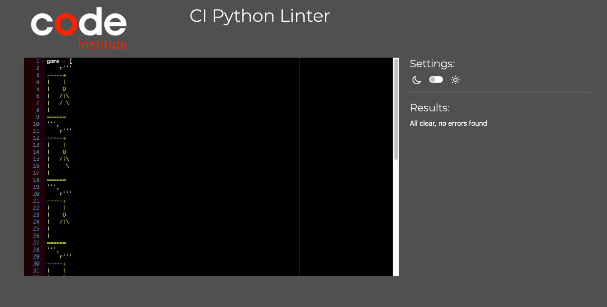

# Hangman Game

Welcome to the **Hangman Game**! This is a python-based command-line game where player guess the letters of a hidden country name. The game offers three continents to choose from, and the player must guess the country within a limited number of attempts before the hangman is fully drawn.

Link to the live project: [Hangman Game](https://aimanh04-hangman-game-pp3-fd9d34e261c1.herokuapp.com/)

## HOW TO PLAY

The Hangman Game is a simple word-guessing game where the player has to guess the hidden country name letter by letter. The game revolves around a "hangman" figure, and with each incorrect guess, a part of the figure will be drawn. If the figure is fully drawn before the word is guessed, the player loses. Here's a step-by-step breakdown:

#### 1. Start the Game:
- When the game begins, you are presented with a choice to either play the game or view instructions.
- If you choose to play the game, you will be prompted to select a continent: America, Asia or Europe.

#### 2. Choosing a Continent:
- Based on your continent selection, the game will randomly choose a country from that region.
- The name of this country is hidden, and it is your task to guess it by suggesting letters one by one.

#### 3. Guessing Letters:
- You input one letter at a time.
- If the letter is in the country's name, it will appear in it's correct position(s).
- If the letter is not in the name, a part of the hangman figure will be drawn, indicating a wrong guess.

#### 4. Winning the Game:
- The objective is to guess the name of the country before the entire hangman figure is drawn.
- The hangman consists of 6 parts, representing 6 incorrect guesses. If you guess all letters correctly before reaching 6 incorrect guesses, you win the game.

#### 5. Losing the Game:
- If you make 6 incorrect guesses, the hangman figure is completed, and you lose the round. The correct name of the country is then revealed.

#### 6. Play Again:
- After a win or loss, you have the option to play again or quit the game. The game will prompt you to enter 'Y' to restart or 'N' to quit.

#### Addition Details:
- You cannot guess the same letter twice; if you do, the game will prompt you to enter a new letter.
- Spaces and special characters are ignored, so you need to focus on the alphabetical letters in the country name.
- You have six incorrect attempts before the game ends, so you need to think carefully about each guess.

## USER EXPERIENCE

### User Stories:
#### First-Time User Goals
- I want to play a word guessing quiz - Hangman
- I want clear instructions on how to play.
- I want an easy way to start the game or view instructions.
- I want to choose from different continents for variety.
- I want feedback on whether my guesses are correct or incorrect.
- I want the game to prevent repeated guesses.

#### Returning User Goals
- I want to skip instructions and start the game quickly.
- I want to restart the game easily after each round.
- I want smooth gameplay without crashes or errors.

### Visual Design:
- **Logo**: A stylized art logo welcomes users when the game launches, creating an engaging start.

- **Feedback Colors**: The game uses color-coded text for feedback.
    - **Green** for correct guesses.
    - **Red** for incorrect guesses.
    - **Yellow** for repeated guesses.

- **Clear Game Progress**: The current state of the guessed country and the hangman drawing is displayed after each guess, ensuring the player can easily track their progress.

## FLOW CHART

## FEATURES

## IMPORTED LIBRARIES

#### 1. random:
- Used for selecting a random country from the list based on the chosen continent.

#### 2. os:
- Enables the clearing of the terminal screen for a cleaner visual experience.

#### 3. colorama:
- Adds colored text output to improve user feedback (e.g., red for incorrect guesses, green for correct ones.)

#### 4. american_countries, asian_countries, european_countries:
- Custom modules that contain lists of countries by continent.

#### 5. hangman_game:
- A custom module that contain the drawings of the hangman game.

## TECHNOLOGIES USED

### Languages

- Python

### Frameworks, Libraries and Programes used

- [GitHub](https://GitHub.com/) - To save and store files for the project
- [Gitpod](https://gitpod.io/) - To use as workspace to code project
- [Chrome Lighthouse](https://developers.google.com/web/tools/lighthouse) - To test the websites performance and accesibility
- [Am I Responsive](https://ui.dev/amiresponsive) - Used to test responsivness
- [Lucid Chart](https://www.lucidchart.com/pages/) - Used to create a flow chart.
- [PEP8 CI Python Linter](https://pep8ci.herokuapp.com/) - Used to validate my python code.
- [Heroku](https://dashboard.heroku.com/) - Used to deploy python project.
- Code Institute's Gitpod template to generate IDE workspace.

## TESTING

Thorough testing has been performed to ensure the Hangman game operates smoothly and meets user expectations. This section covers the various types of tests conducted, including manual testing, functionality checks, and user experience evaluations.

### 1. Manual Testing

#### Game Menu:
- **Test**: Selecting the option to start the game.
    - **Expected Results**: The should display continent choices.
    - **Results**: Works as expected.
- **Test**: Selecting the "How to Play" option.
    - **Expected Results**: Instructions should display clearly.
    - **Results**: Displays instructions correctly and allows players to proceed to the game by typing "yes."

#### Continent Selection:
- **Test**: Entering valid continent options (1, 2, 3).
    - **Expected Results**: The game proceeds and generates a country based on the selected continent.
    - **Results**: Works as expected for all continents.
- **Test**: Entering an invalid continent option (e.g., 0, 4, alphabet).
    - **Expected Results**: The game should notify the user of invalid input and prompt them to re-enter a valid option
    - **Results**: Displays the correct error message and prompts for valid input.

#### Letter Guessing:
- **Test**: Entering a valid letter (a,z).
    - **Expected Results**: If the letter is in the word, it is revealed in its correct position(s); otherwise, it is marked as incorrect.
    - **Results**: Functions correctly for both correct and incorrect guesses.
- **Test**: Entering multiple letters or invalid characters.
    - **Expected Results**: The game should reject the input and prompt the user to enter a single letter.
    - **Results**: Reject invalid input and prompts correct input.
- **Test**: Re-entering a letter that was already guessed.
    - **Expected Results**: The game should notify the user that the letter was already guessed.
    - **Results**: Correctly notifies the user and does not count it as a new guess.

#### Winning & Losing Conditions:
- **Test**: Guessing the word correctly before running out of attempts.
    - **Expected Results**: The game should congratulate the player and ask if they want to play again.
    - **Results**: Works as expected; displays the winning message and prompts for replay.
- **Test**: Running out of attempts.
    - **Expected Results**: The game should notify the player of the loss and reveal the correct word.
    - **Results**: Displays the losing message and reveals the word, followed by the replay prompt.

#### Replay Functionality:
- **Test**: Choosing to replay after a win or loss.
    - **Expected Results**: The game should restart with menu screen.
    - **Results**: Restarts the game successfully.
- **Test**: Declining to replay (Choosing "N").
    - **Expected Results**: The game should display a thank-you message and terminate.
    - **Results**: Exits as expected with a thank-you message.

### 2. Validation Testing

run.py

No errors or warnings detected.

hangman_game.py

No errors or warnings detected.

- **PEP8 Compliance**: The code was run through a PEP8 linter to ensure that it follows Python’s style guide. The following issues were addressed:
    - Trailing whitespace was removed.
    - Line lengths were shortened to adhere to the 79-character limit.
    - Blank lines were added where appropriate for readability.
- **Syntax Testing**: The code was checked for any syntax errors, especially around string formatting and escape sequences in the ASCII art.

### 3. Cross-Browser and Cross-Platform Testing

- **Browsers**: The game was tested across multiple web browsers (Chrome, Firefox, Safari) to ensure proper functionality and display.

- **Devices**: The game was also tested on different devices (desktop, tablet, and mobile) to check for responsiveness and usability.

### 4. User Experience Testing
- **Test**: Ensuring that the game flow is intuitive for first-time users
    -**Results**: First-time users were able to navigate the game easily, understanding the flow of guessing letters, winning/losing, and replaying.
- **Test**: Checking if the game provides sufficient feedback to guide players (correct/incorrect guesses, error messages).
    -**Results**: Players receive clear feedback on their guesses and overall progress.

## DEPLOYMENT

### Steps for deployment on Heroku
1. Go to the [Heroku](https://dashboard.heroku.com/) website.
2. Click on the "Create new app" option on the dashboard.
3. Give it your project name, select your region and go on the "Create app" option.
4. Click the settings tab.
5. Go to "Reveal Config Vars" and store all your sensitive data such as creds.json & port data.
6. Set the buildbacks to Python & Nodejs in that order.
7. Click on the deploy tab.
8. Select Github as a deployment method.
9. Connect it to your Github.
10. Authorize the correct repo to connect.
11. Choose to either "Enable Automatic" or on "Deploy Branch" to deploy the project.
12. Go on "View" to see your live project.

### Forking the Github Repository
The steps to fork the github repository are:
1. Log in to your [GitHub](https://github.com/).
2. Go to the repository for Aimanh04-Hangman-Game.
3. Click fork on the right hand side of the screen.

### Making a local clone
To clone this repository, do the following steps:
1. Log in to your [GitHub](https://github.com/).
2. Go to the repository for this project [Aimanh04-Hangman-Game](https://aimanh04-hangman-game-pp3-fd9d34e261c1.herokuapp.com/).
3. Click on the code button and select whether you would like to clone with HTTPS, SSH or GitHub CLI and then copy the URL to your clipboard.
4. Open the terminal in your selected code editor and change the current working directory to the location of where you want the cloned directory.
5. Type "git clone" into the terminal, paste the link you copied and press enter.

## CREDITS

### Special Thanks To

- **Youtube** and **Wikipedia** for explanation and details to the Hangman game.

- **Code Institute** for providing the foundational python knowledge.

- **Stack Overflow** for helpful solutions regarding python code and error handling.

- **W3Schools** for helpful solutions regarding python code and error handling.

- **ASCII Art** for game title.
